# Strong Bruce Chatroom

Strong Bruce Chatroom is a real-time web chatroom application built with React, Vite, Firebase Authentication, Cloud Firestore, Firebase Hosting, and the GIPHY API.

This README explains:

1. how to operate the website,
2. where each scoring-related function is implemented,
3. how TAs can find and test each function,
4. how to set up the project locally.

---

## Website Links

```text
Firebase Hosting URL: https://ss-mid-3bd1d.web.app
GitHub Repository: https://github.com/Zzz12121/software_studio_midterm-chatroom.git
```

If the Firebase Hosting URL above is different from the submitted eeclass URL, please use the eeclass submitted URL as the final deployed website.

---

## Website Overview

When users open the website, the app first displays an intro animation.

The animation starts with ASCII art of my friend "Strong Bruce" and then transitions into the brand title:

```text
Strong Bruce Chatroom
```

After the animation finishes, the app automatically enters either:

- the sign-in / sign-up page, if the user is not logged in
- the chatroom page, if the user has already logged in

The main chatroom interface uses a Messenger-like layout:

- left sidebar: user menu, create chatroom panel, and chatroom list
- right panel: selected chatroom, message history, search bar, chatroom settings, and message input area

---

# Feature Guide

## 1. Opening Animation and Branding

**Score category:** Advanced Component - CSS Animation (2%)

### Function

The website starts with a splash animation. The screen first shows ASCII art, then transitions into the brand name `Strong Bruce Chatroom`.

### How to Use

1. Open or refresh the website.
2. Watch the ASCII art intro.
3. Wait for it to transform into `Strong Bruce Chatroom`.
4. The app automatically enters the login page or chatroom page.


### Location

```text
src/components/common/SplashScreen.jsx
src/assets/strong_bruce_ascii_art.txt
src/index.css
```


---

## 2. Email Sign Up

**Score category:** Basic Component - Membership Mechanism (5%)

### Function

Users can create an account using email and password.

### How to Use

1. Open the website.
2. Click `Sign Up`.
3. Enter email, password, and username.
4. Click `Sign Up`.
5. The account is created in Firebase Authentication.
6. A user profile document is created in Firestore under `users/{uid}`.

### Firestore User Document

```js
{
  uid: "user uid",
  email: "user@example.com",
  username: "username",
  phone: "",
  address: "",
  photoURL: "",
  blockedUsers: [],
  createdAt: timestamp,
  updatedAt: timestamp
}
```

### Location

```text
src/pages/SignUpPage.jsx
src/contexts/AuthContext.jsx
src/firebase/firebase.js
```
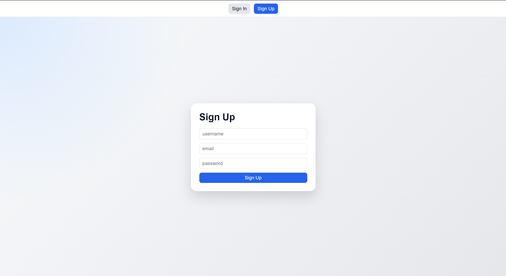
---

## 3. Email Sign In

**Score category:** Basic Component - Membership Mechanism (5%)

### Function

Registered users can sign in with email and password.

### How to Use

1. Click `Sign In`.
2. Enter email and password.
3. Click `Sign In`.
4. The user enters the chatroom page.

### Location

```text
src/pages/SignInPage.jsx
src/contexts/AuthContext.jsx
src/firebase/firebase.js
```
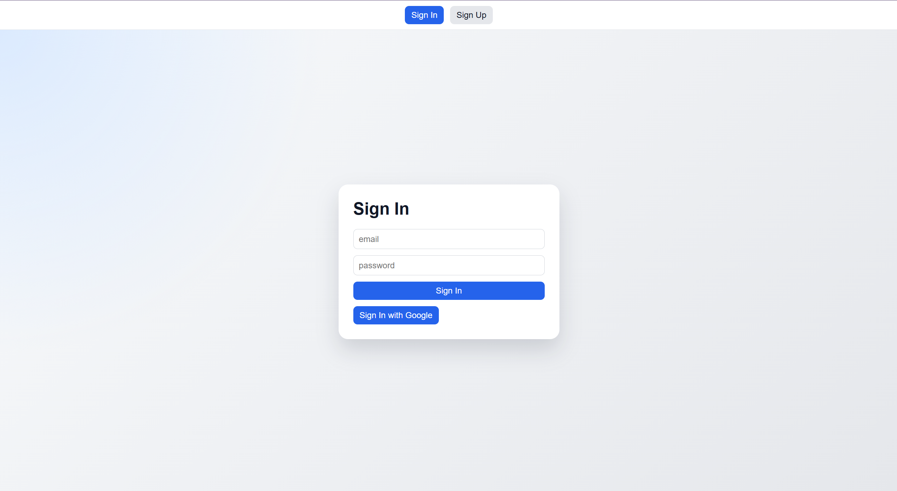
---

## 4. Google Sign In

**Score category:** Advanced Component - Third-party Sign In (1%)

### Function

Users can sign in with a Google account.

When a user signs in with Google, the app creates or updates the user's Firestore profile document so that other users can find this account by Gmail.

### How to Use

1. Go to the `Sign In` page.
2. Click `Sign In with Google`.
3. Choose a Google account.
4. The user enters the chatroom page.

### Important Behavior

Google login creates or updates:

```text
users/{uid}
```

This allows:

- Gmail-based user search
- username display
- profile picture display
- direct chatroom avatar and name display

### Location

```text
src/pages/SignInPage.jsx
src/firebase/firebase.js
```
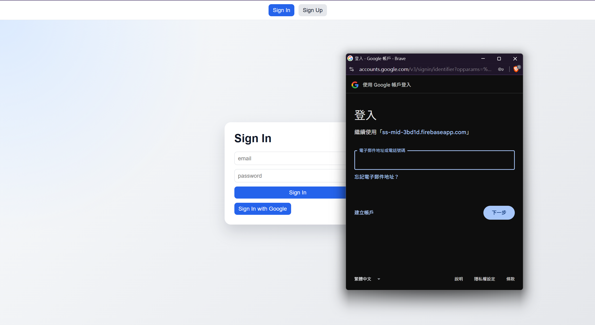
---

## 5. Firebase Hosting

**Score category:** Basic Component - Firebase Hosting (5%)

### Function

The project is deployed using Firebase Hosting.

### How to Use

1. Open the deployed Firebase Hosting URL.
2. The splash animation appears first.
3. The app enters the login page or the chatroom page.

### Location

```text
firebase.json
.firebaserc
dist/
```
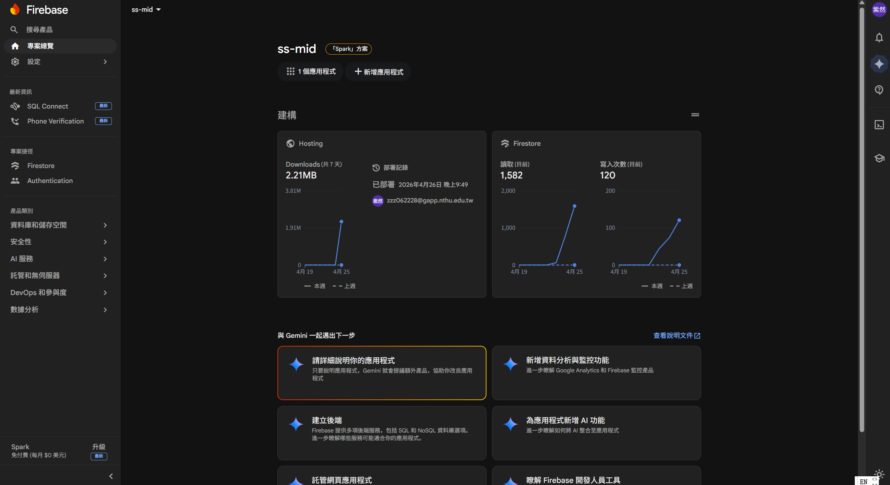
---

## 6. Authenticated Database Read and Write

**Score category:** Basic Component - Database Read / Write (5%)

### Function

The app uses Cloud Firestore to store users, chatrooms, and messages.
All Firestore read/write operations are protected by Firebase Authentication. Users must sign in before accessing `users`, `chatrooms`, or `messages`. Firestore Security Rules check `request.auth != null`, and chatroom/message access is limited to authenticated chatroom members.

### Main Collections

```text
users
chatrooms
chatrooms/{chatroomId}/messages
```

### Chatroom Document Example

```js
{
  type: "direct" | "group",
  name: "group name",
  photoURL: "group photo url",
  createdBy: "uid",
  members: ["uid1", "uid2"],
  lastMessage: "latest message preview",
  lastSenderId: "uid",
  lastMessageAt: timestamp,
  createdAt: timestamp,
  updatedAt: timestamp
}
```

### Message Document Example

```js
{
  senderId: "uid",
  text: "message text",
  type: "text" | "image" | "gif",
  imageURL: "",
  imageName: "",
  gifURL: "",
  gifTitle: "",
  giphyURL: "",
  unsent: false,
  edited: false,
  replyTo: null,
  reactions: {},
  createdAt: timestamp,
  updatedAt: timestamp
}
```

### Location

```text
src/pages/SignUpPage.jsx
src/pages/SignInPage.jsx
src/pages/ChatPage.jsx
src/pages/ProfilePage.jsx
src/components/chat/
```

---

## 7. Responsive Web Design

**Score category:** Basic Component - RWD (5%)

### Function

The website layout adapts to different screen sizes.

### How to Test

1. Open the website.
2. Resize the browser window.
3. Confirm that the chatroom layout remains usable.
4. Confirm that the whole page does not create unnecessary full-page scrolling.
5. Confirm that only internal areas scroll:
   - chatroom list
   - message area
   - dropdown panels
   - GIF search panel

### Location

```text
src/index.css
src/pages/ChatPage.jsx
```

---

## 8. Git Version Control

**Score category:** Basic Component - Git (5%)

### Function

The project uses Git and GitHub for version control.

### Location

```text
GitHub Repository: https://github.com/Zzz12121/software_studio_midterm-chatroom.git
```
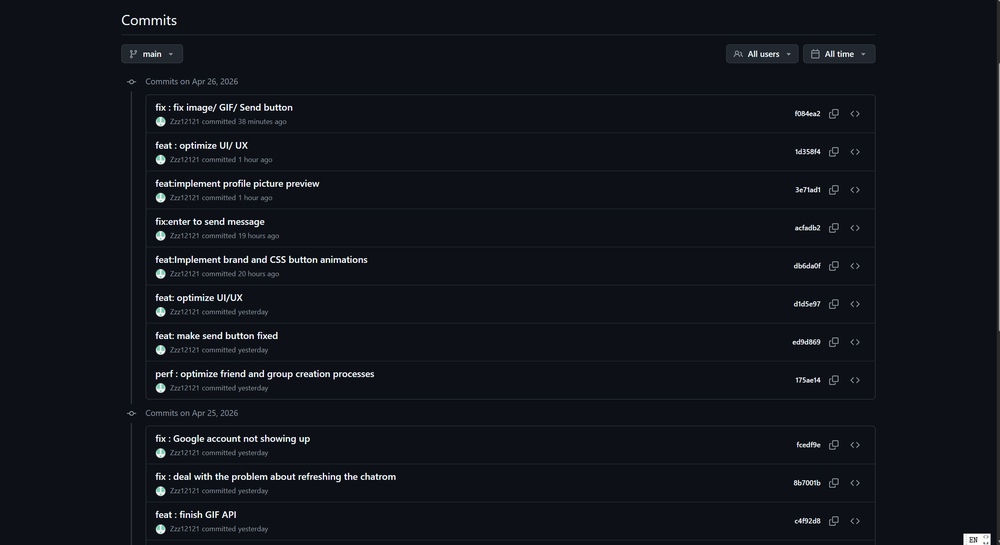
---

# Chatroom Features

## 9. Main Chatroom Layout

### Function

After login, the user enters the main chatroom page.

### Left Sidebar

- user avatar
- username / email
- user dropdown menu
- create chatroom form
- chatroom list
- unread badges

### Right Panel

- selected chatroom header
- chatroom setting dropdown
- message search input
- message history
- message input area
- Image / GIF / Send controls

### Location

```text
src/pages/ChatPage.jsx
src/components/layout/UserMenu.jsx
src/components/chat/ChatroomList.jsx
src/components/chat/ChatroomMenu.jsx
src/components/chat/MessageList.jsx
src/components/chat/MessageInput.jsx
```

---

## 10. Create Direct Chatroom by Gmail

**Score category:** Basic Component - Chatroom (part of 25%)

### Function

Users can create private one-to-one chatrooms by entering another user's Gmail address.

### How to Use

1. Sign in.
2. Go to the left sidebar.
3. In `Create Chatroom`, select `direct`.
4. Enter the other user's Gmail.
5. Click `Create Chatroom`.

### Important Behavior

For direct chatrooms:

- the chatroom name is the other user's username
- the chatroom avatar is the other user's profile picture
- if username is unavailable, email is used as fallback

### Location

```text
Left sidebar → Create Chatroom → direct
```
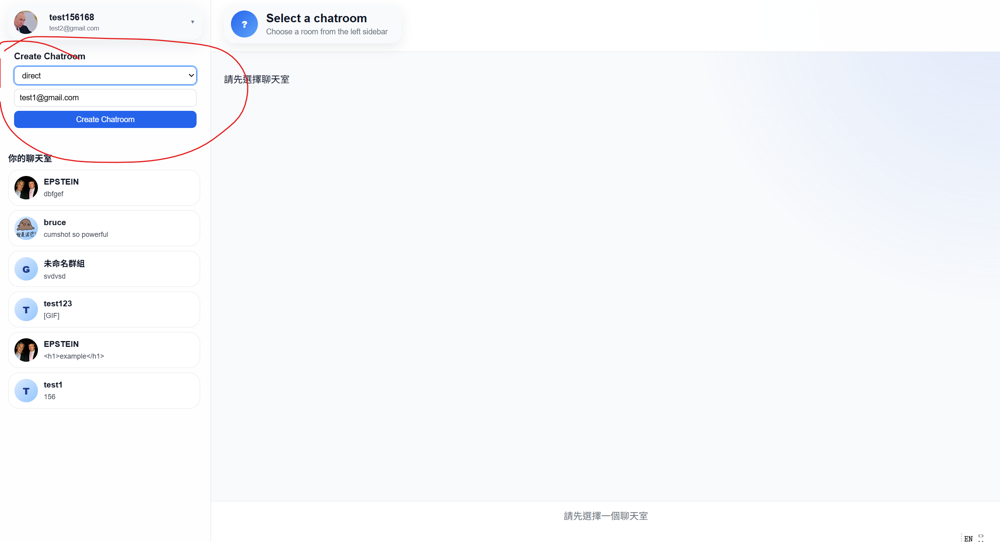
---

## 11. Create Group Chatroom by Gmail

**Score category:** Basic Component - Chatroom (part of 25%)

### Function

Users can create group chatrooms by entering member Gmail addresses.

### How to Use

1. Sign in.
2. Go to the left sidebar.
3. In `Create Chatroom`, select `group`.
4. Enter a group name.
5. Optionally enter a group avatar URL.
6. Enter member Gmail addresses separated by commas.
7. Click `Create Chatroom`.

### Example

```text
test1@gmail.com, test2@gmail.com, test3@gmail.com
```

### Location

```text
Left sidebar → Create Chatroom → group
```
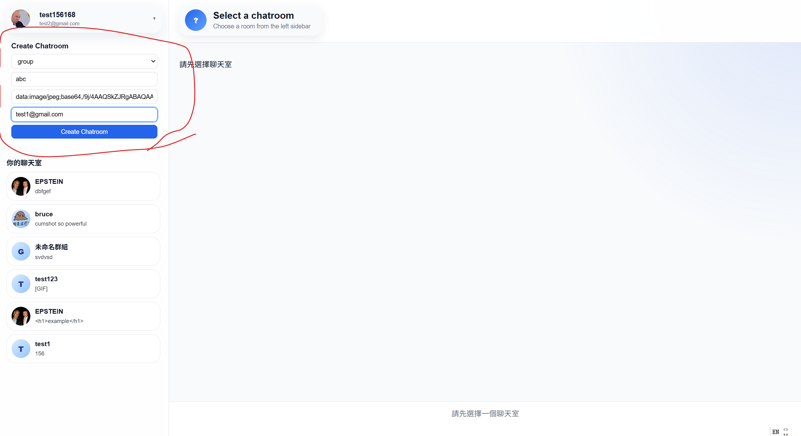
---

## 12. Chatroom List with Avatar, Last Message, and Unread Badge

### Function

The left sidebar displays all chatrooms joined by the current user.

Each chatroom card shows:

- avatar
- chatroom name
- latest message preview
- unread red badge

### Direct Chatroom Display

Direct chatrooms display the other user's username and profile picture.

### Group Chatroom Display

Group chatrooms display the group name and group avatar.

### Location

```text
Left sidebar → 你的聊天室
```

---

## 13. Real-Time Message Sending

**Score category:** Basic Component - Chatroom (part of 25%)

### Function

Users can send real-time text messages.

### How to Use

1. Select a chatroom.
2. Type a message.
3. Press `Enter` or click `Send`.

### Keyboard Behavior

```text
Enter = send message
Shift + Enter = new line
```

### Location

```text
Bottom message input area
```

---

## 14. Load Message History

**Score category:** Basic Component - Chatroom (part of 25%)

### Function

Previous messages are loaded from Firestore when a chatroom is opened.

### How to Use

1. Select a chatroom.
2. Previous messages appear in the message area.

### Location

```text
Right message area
```

---

## 15. Invite Member by Gmail

**Score category:** Basic Component - Chatroom Invite (part of 25%)

### Function

Users can invite new members to a chatroom by Gmail.

### How to Use

1. Select a chatroom.
2. Click the chatroom header bar.
3. Find `Invite Member`.
4. Enter the target user's Gmail.
5. Click `Invite`.

### Location

```text
Selected chatroom → top chatroom bar → Invite Member
```
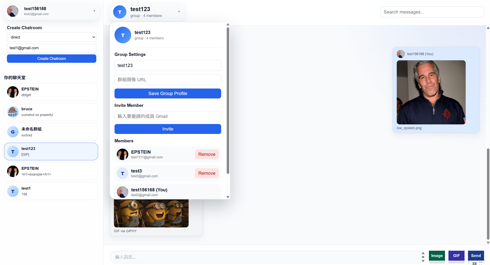
---

## 16. View Chatroom Members

### Function

Users can view all members in the selected chatroom.

### How to Use

1. Select a chatroom.
2. Click the chatroom header bar.
3. Find the `Members` section.

The member list shows:

- profile picture
- username
- email
- current user indicator

### Location

```text
Selected chatroom → top chatroom bar → Members
```

---

## 17. Remove Group Member

### Function

Group chatrooms support member removal.

### How to Use

1. Select a group chatroom.
2. Click the chatroom header bar.
3. Open `Members`.
4. Click `Remove`.

### Important Behavior

- Only group chatrooms show `Remove`.
- Direct chatrooms do not show `Remove`.
- Removed users no longer see the group chatroom.

### Location

```text
Group chatroom → top chatroom bar → Members → Remove
```

---

## 18. Edit Group Chatroom Name and Avatar

### Function

Group chatrooms support editable group name and group avatar URL.

### How to Use

1. Select a group chatroom.
2. Click the chatroom header bar.
3. In `Group Settings`, edit the group name or avatar URL.
4. Click `Save Group Profile`.

### Location

```text
Group chatroom → top chatroom bar → Group Settings
```

---

# Advanced Features

## 19. React Framework

**Score category:** Advanced Component - React Framework (5%)

The project is built with React and Vite.

### Location

```text
src/main.jsx
src/App.jsx
src/components/
src/pages/
```

---

## 20. Chrome Unread Notification

**Score category:** Advanced Component - Chrome Notification (5%)

### Function

The app supports Chrome notifications for unread messages.

### How to Use

1. Open the website in Chrome.
2. Allow notification permission.
3. Stay outside a chatroom or switch to another chatroom.
4. When a new unread message arrives, Chrome displays a notification.

### Location

```text
src/components/chat/NotificationManager.jsx
src/components/chat/ChatroomList.jsx
```

---

## 21. CSS Animation

**Score category:** Advanced Component - CSS Animation (2%)

### Implemented Animations

- ASCII art splash animation
- Strong Bruce Chatroom brand transition
- message render animation
- unread badge pulse animation
- send/ GIF/ image button
### Notes


### Location

```text
src/components/common/SplashScreen.jsx
src/index.css
```

---

## 22. Safe Display for Code Messages

**Score category:** Advanced Component - Deal with Problems When Sending Code (2%)

### Function

Messages that look like HTML or JavaScript code are displayed as plain text.

### Test Case

Send:

```html
<script>alert("example");</script>
```

Expected:

- it appears as text
- it is not executed
- no alert appears

Send:

```html
<h1>example</h1>
```

Expected:

- it appears as text
- it does not become a real heading

### Location

```text
src/components/chat/MessageList.jsx
```

---

## 23. User Profile Page

**Score category:** Advanced Component - User Profile (10%)

### Function

Users can edit profile information.

Editable fields:

- profile picture URL
- username
- email
- phone number
- address

### Current Profile Picture Behavior

The profile picture is edited by entering an image URL.

The profile page immediately previews the image represented by the current URL before the user saves. If the URL is invalid, the app shows a fallback avatar and an error message. The URL is saved only after the user clicks `Save Profile`.

### How to Use

1. Click the top-left user avatar / username.
2. Click `Profile Settings`.
3. Edit the profile fields.
4. Paste a profile picture URL.
5. Confirm that the preview image updates immediately.
6. Click `Save Profile`.
7. Click `Back to Chat`.

### Example Image URLs for Testing

```text
https://picsum.photos/200
https://i.pravatar.cc/200
```

### Location

```text
Top-left user menu → Profile Settings
src/pages/ProfilePage.jsx
```
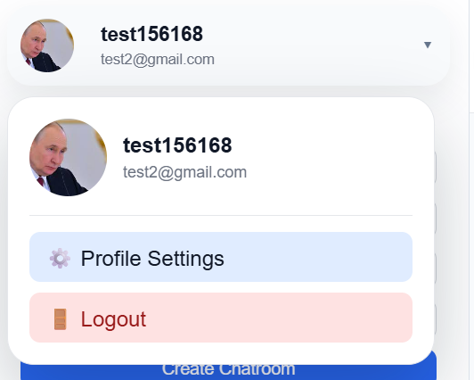
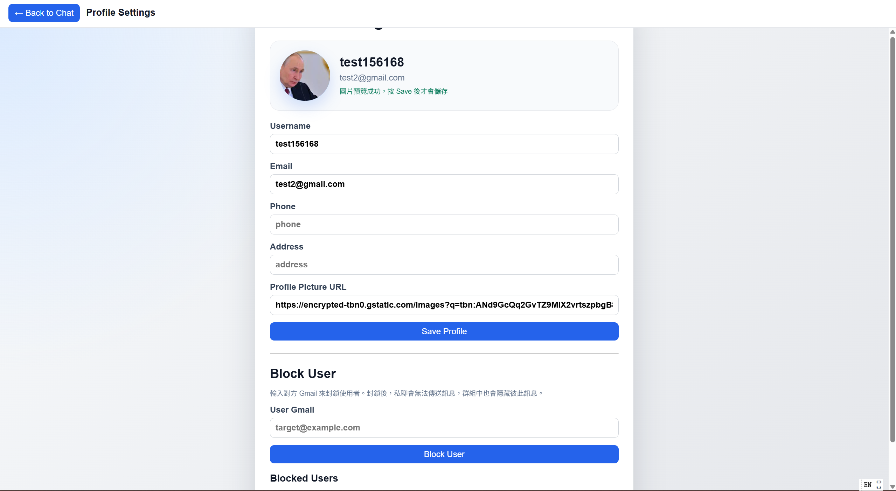
---

# Message Operations

## 24. Unsend Own Message

**Score category:** Advanced Component - Message Operation (part of 10%)

### How to Use

1. Hover over your own message.
2. Click the trash can icon.
3. The message becomes:

```text
此訊息已收回
```

### Important Behavior

- users can only unsend their own messages
- image and GIF messages can also be unsent
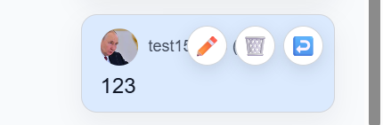
---

## 25. Edit Own Text Message

**Score category:** Advanced Component - Message Operation (part of 10%)

### How to Use

1. Hover over your own text message.
2. Click the pencil icon.
3. Edit the message.
4. Save.

### Important Behavior

- only text messages can be edited
- image and GIF messages cannot be edited

---

## 26. Search Messages

**Score category:** Advanced Component - Message Operation (part of 10%)

### How to Use

1. Select a chatroom.
2. Use the top-right search box.
3. Type a keyword.
4. Matching messages are displayed.
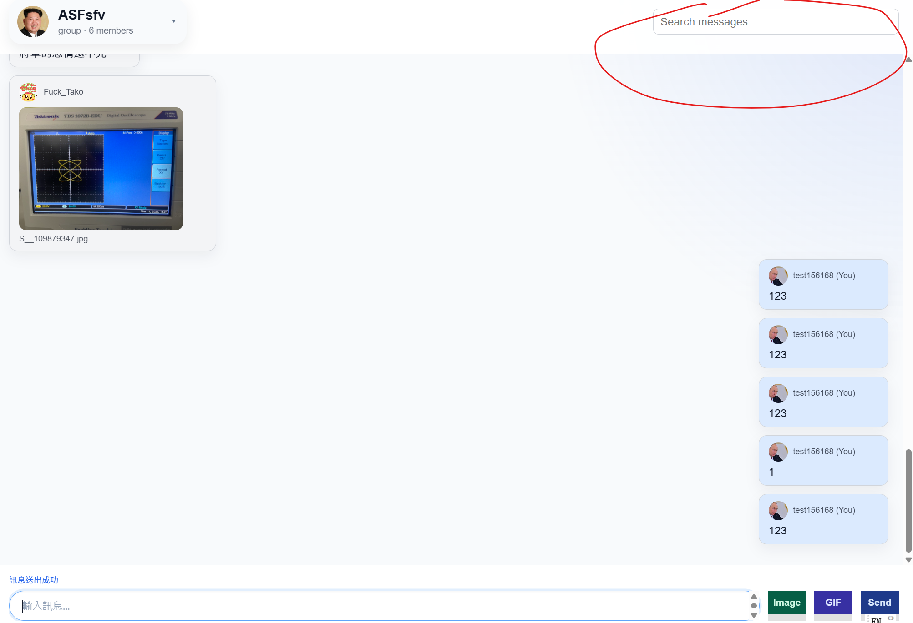
---

## 27. Send Image

**Score category:** Advanced Component - Message Operation (part of 10%)

### How to Use

1. Select a chatroom.
2. Click `Image`.
3. Select an image file from the local computer.
4. Confirm the preview.
5. Click `Send`.

### Important Behavior

- image size is limited
- image messages can be unsent
- image messages are displayed in the message list

### Notes

This message image feature uses local image file upload through the browser input. The profile picture feature uses image URL input and preview.

---

## 28. Unsend Image

**Score category:** Advanced Component - Message Operation (part of 10%)

### How to Use

1. Send an image.
2. Hover over the image message.
3. Click the trash can icon.
4. The image is removed and the message becomes:

```text
此訊息已收回
```

---

## 29. Hover Message Action Icons

### Function

Message action icons appear only when hovering over a message.

### Icons

For own text messages:

```text
pencil icon = edit
trash can icon = unsend
reply icon = reply
```

For own image or GIF messages:

```text
trash can icon = unsend
reply icon = reply
```

For other users' messages:

```text
reply icon = reply
```
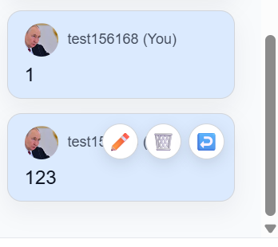
---

# Bonus Features

## 30. Block User

**Score category:** Bonus Component - Block User (2%)

### Function

Users can block other users by Gmail from the profile settings page.

### How to Use

1. Click the top-left user avatar / username.
2. Click `Profile Settings`.
3. Find the `Block User` section.
4. Enter the target user's Gmail.
5. Click `Block User`.
6. The blocked user appears in the `Blocked Users` list.
7. Click `Unblock` to remove the user from the block list.

### Direct Chatroom Behavior

If a user is blocked:

- a warning is shown in the direct chat
- sending messages is disabled in the blocked direct chat

### Group Chatroom Behavior

When the blocker and blocked user are in the same group chat:

- their messages are mutually hidden

### Location

```text
Top-left user menu → Profile Settings → Block User
src/pages/ProfilePage.jsx
src/pages/ChatPage.jsx
src/components/chat/MessageList.jsx
```

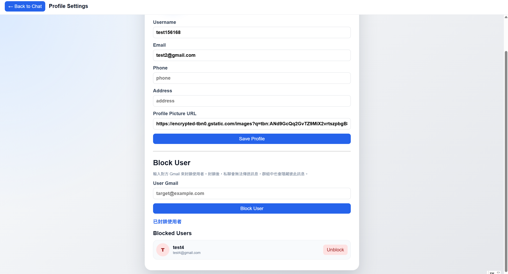
---

## 31. Reply to Specific Message

**Score category:** Bonus Component - Reply for Specific Message (6%)

### How to Use

1. Hover over a message.
2. Click the reply icon.
3. The original message appears above the input.
4. Send the reply.

### Implemented Behavior

- reply preview is shown above the input
- sent reply message shows the original message preview
- clicking the reply preview highlights the original message
- clicking the reply preview scrolls to the original message
- replies support text, image, GIF, and unsent message previews

---

## 32. Send GIF with GIPHY API

**Score category:** Bonus Component - Send GIF API (3%)

### Function

Users can search and send GIFs using the GIPHY API.

The original assignment mentioned Tenor API, but the implementation uses GIPHY because the original Tenor API option was no longer available.

### How to Use

1. Select a chatroom.
2. Click `GIF`.
3. Type a keyword, such as:

```text
happy
```

4. Click `Search`.
5. Click one GIF from the result grid.
6. The GIF is sent to the chatroom.

### Important Behavior

- only GIF URLs and metadata are stored in Firestore
- GIF files are loaded from GIPHY
- GIF messages cannot be edited
- GIF messages can be unsent
- GIF messages can be replied to
- chatroom latest message shows `[GIF]`
<!--
### Required Environment Variable

```env
VITE_GIPHY_API_KEY=your_giphy_api_key
```
-->
---

# Extra UI and Usability Features

## 33. User Dropdown Menu

### Function

Clicking the top-left user profile opens a dropdown.

### Options

- Profile Settings
- Logout

Clicking outside the dropdown closes it.

---

## 34. Chatroom Dropdown Menu

### Function

Clicking the selected chatroom header opens the chatroom menu.

### Direct Chatroom Menu

- Invite Member
- Members list

### Group Chatroom Menu

- Group Settings
- Edit group name
- Edit group avatar URL
- Invite Member
- Members list
- Remove member controls

### How to Edit Group Name and Group Avatar

1. Select a group chatroom.
2. Click the selected chatroom header at the top of the chat area.
3. Find the `Group Settings` section.
4. Edit the group name.
5. Edit the group avatar URL.
6. Click `Save Group Profile`.
7. The updated group name and avatar will appear in the chatroom header and the left chatroom list.

### How to Remove Group Members

1. Select a group chatroom.
2. Click the selected chatroom header at the top of the chat area.
3. Find the `Members` section.
4. Click `Remove` next to the member you want to remove.
5. The removed user will no longer see this group chatroom in their chatroom list.

### Important Behavior

- Group name and group avatar editing are only available in group chatrooms.
- Member removal is only available in group chatrooms.
- Direct chatrooms do not show group editing or remove member controls.
- Clicking outside the dropdown closes it.

---

## 35. Message Input Usability

### Function

The message input area remains usable with long text, image preview, and reply preview.

### Behavior

- textarea grows with content
- textarea scrolls internally after reaching maximum height
- Image / GIF / Send buttons remain visible
- `Enter` sends message
- `Shift + Enter` creates a new line

---

## 36. Horizontal Hover Button Effect

### Function

The Image, GIF, and Send buttons use a horizontal block-style hover effect.

### How to Use

Move the mouse over `Image`, `GIF`, or `Send`. The button moves upward on hover.

### Notes

This is a UI polish effect and is not the main CSS animation scoring item.

---

## 37. Auto-scroll to Latest Message

### Function

When users enter or re-enter a chatroom, the message area automatically scrolls to the newest message.

### How to Test

1. Open a chatroom with many messages.
2. Scroll upward.
3. Switch to another chatroom.
4. Switch back.
5. The latest message should be visible.

---

## 38. Floating Panels Close on Outside Click

### Function

Floating panels close automatically when clicking outside them.

### Included Panels

- user dropdown menu
- chatroom dropdown menu
- GIF search panel

---

# Score Mapping Summary

## Basic Components

| Requirement | Score | Implemented Location |
|---|---:|---|
| Email Sign Up | 2.5% | Sign Up page |
| Email Sign In | 2.5% | Sign In page |
| Firebase Hosting | 5% | Firebase Hosting deployment |
| Authenticated Database Read / Write | 5% | Firestore users, chatrooms, messages |
| RWD | 5% | `src/index.css` |
| Git version control | 5% | GitHub repository |
| Create private chatrooms | part of 25% | Create Chatroom panel |
| Other members can see messages | part of 25% | Firestore real-time messages |
| Load chat history | part of 25% | MessageList |
| Invite new members | part of 25% | Chatroom menu → Invite Member |
| Group chatroom logic | part of 25% | Chatroom layout, group members, remove member |

---

## Advanced Components

| Requirement | Score | Implemented Location |
|---|---:|---|
| React framework | 5% | Entire project |
| Google Sign In | 1% | Sign In page |
| Chrome unread notification | 5% | NotificationManager / ChatroomList |
| CSS animation | 2% | Splash animation |
| Safe code message display | 2% | MessageList |
| User Profile | 10% | Profile Settings page |
| Unsend message | part of 10% | Message hover actions |
| Edit message | part of 10% | Message hover actions |
| Search message | part of 10% | Chatroom search input |
| Send image | part of 10% | Message input Image button |
| Unsend image | part of 10% | Image message hover actions |

---

## Bonus Components

| Requirement | Score | Implemented Location |
|---|---:|---|
| Block User | 2% | Profile Settings → Block User |
| Send GIF by API | 3% | GIPHY GIF picker |
| Reply specific message | 6% | Reply icon, reply preview, highlight, scroll |
| Emoji message | 3% | Not implemented |
| Chatbot | 2% | Not implemented |
| Custom sticker | 10% | Not implemented |

Implemented bonus total:

```text
Block User: 2%
GIPHY GIF: 3%
Reply specific message: 6%
Total implemented bonus: 11%
Maximum counted bonus: 10%
```

---
<!-- 
# Recommended TA Testing Flow

## Step 1: Authentication

1. Open the website.
2. Watch the Strong Bruce Chatroom intro animation.
3. Use Email Sign Up.
4. Log out.
5. Use Email Sign In.
6. Log out.
7. Use Google Sign In.

## Step 2: Profile

1. Click the top-left user menu.
2. Click `Profile Settings`.
3. Edit username, phone, address, email, and profile picture URL.
4. Confirm the profile picture URL preview updates before saving.
5. Save.
6. Go back to chat.

## Step 3: Direct Chatroom

1. Use another registered user's Gmail.
2. Create a direct chatroom.
3. Confirm the direct chatroom shows the other user's username and avatar.
4. Send messages.
5. Confirm the other user can see messages.

## Step 4: Group Chatroom

1. Create a group chatroom.
2. Add multiple members by Gmail.
3. Open group settings from the chatroom header.
4. Change group name and avatar URL.
5. Invite another member.
6. Remove a member.

## Step 5: Message Operations

1. Send text.
2. Edit own text message.
3. Unsend own text message.
4. Send image.
5. Unsend image.
6. Send GIF.
7. Unsend GIF.
8. Search messages.

## Step 6: Reply

1. Hover over a message.
2. Click reply icon.
3. Confirm original message appears above the input.
4. Send reply.
5. Click the reply preview.
6. Confirm the original message is highlighted and scrolled into view.

## Step 7: Notification

1. Use two accounts.
2. Open different chatrooms.
3. Send a message from one account.
4. Confirm unread badge appears.
5. Confirm Chrome notification appears if permission is granted.

## Step 8: Block User

1. Go to `Profile Settings`.
2. In `Block User`, enter another user's Gmail.
3. Click `Block User`.
4. Confirm the user appears in the blocked list.
5. Open a direct chatroom with that user.
6. Confirm the direct chat warning appears.
7. Confirm sending is disabled if the direct chat is blocked.
8. In a group chatroom, confirm blocked users' messages are hidden.
9. Return to profile and click `Unblock` to restore the relationship.

---
-->
# Local Setup

## 1. Clone the Repository

```bash
git clone https://github.com/Zzz12121/software_studio_midterm-chatroom.git
cd software_studio_midterm-chatroom
```

If your local folder name is different, enter the folder that contains `package.json`.

---

## 2. Install Dependencies

```bash
npm install
```

Do not upload `node_modules` when submitting the project.

---

## 3. Create Environment File

Create a `.env` file in the project root.

```env
VITE_GIPHY_API_KEY=your_giphy_api_key
```
or
```env
VITE_GIPHY_API_KEY=WwvcJWjuidOln7uvc3iDZnuxoNWNZfFU
```
This is required for the GIF search feature.

---

## 4. Firebase Configuration

The Firebase config is located in:

```text
src/firebase/firebase.js
```

This project uses:

- Firebase Authentication
- Cloud Firestore
- Firebase Hosting

For local testing, the Firebase project must have:

- Email/Password sign-in enabled
- Google sign-in enabled
- Cloud Firestore enabled
- authorized domains set correctly for Google login

---

## 5. Start the Local Development Server

```bash
npm run dev
```

Then open the local URL shown in the terminal, usually:

```text
http://localhost:5173/
```

---

## 6. Build for Production

```bash
npm run build
```

The production build output is generated in:

```text
dist/
```

---

## 7. Deploy to Firebase Hosting

```bash
firebase deploy
```

The project uses `dist` as the Firebase Hosting public directory.

---

# Known Notes

## Image Storage

Image messages are stored as Base64 data in Firestore for demo purposes. To avoid exceeding Firestore document size limitations, the app restricts image size.

## Profile Picture

Profile pictures use image URLs. The profile edit page shows an instant preview before saving.

## GIF Storage

GIF messages use GIPHY URLs instead of storing GIF files directly. Firestore only stores GIF metadata and URL fields.

## GIPHY API Key

The GIF feature requires:

```env
VITE_GIPHY_API_KEY=your_giphy_api_key
```

Without this key, the GIF search panel cannot search GIFs.

## Firebase Storage

Firebase Storage is not required for this project implementation.

## Browser

Chrome is recommended for testing notification features.
